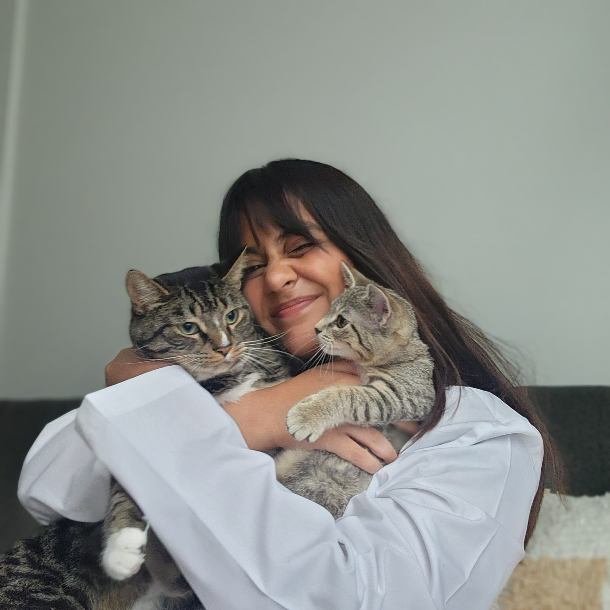

```{=html}
<style>
/* Background only for this page */
html, body {
  background: url("images/knit.jpg") top left / 520px repeat fixed;
  min-height: 100vh;
}

/* Make all Quarto containers transparent */ 
main, #quarto-content, .page-content, .content,
.quarto-container, .page-columns {
  background: transparent !important;
}
</style>

<section class="hero-section">
  <div class="hero-content">
    <div class="hero-photo-card">
      
    </div>
    <div class="hero-text">
      <h1 class="hero-name">Renu Madhuraj Jadhav</h1>
      <p class="hero-title">Computational Health Researcher</p>
      <p class="hero-tagline">Exploring the intersection of AI and medicine</p>
      <div class="hero-buttons">
        <a class="btn-primary" href="cv.pdf">Download CV</a>
        <a class="btn-ghost" href="mailto:renu@example.com">Contact</a>
      </div>
    </div>
  </div>
</section>

<div class="cards">
  <div class="card">
    <h3>About Me</h3>
    <p>I'm a PhD student in Biomedical & Health Informatics at CWRU working at the intersection of machine learning and biomedicine, with a focus on building models that are interpretable, clinically useful, and fair.</p>
    <a href="about.qmd" class="link">Read more</a>
  </div>
  <div class="card">
    <h3>Featured Projects</h3>
    <ul class="bullets">
      <li><strong>LOAD endotyping:</strong> clustering + generative modeling to identify biological subtypes</li>
      <li><strong>Neuro-cognitive chatbot:</strong> adaptive memory prompts with spaced repetition</li>
      <li><strong>BCI feature pipelines:</strong> windowed features for ECoG decoding</li>
    </ul>
    <a href="projects.qmd" class="link">See projects</a>
  </div>
</div>
```